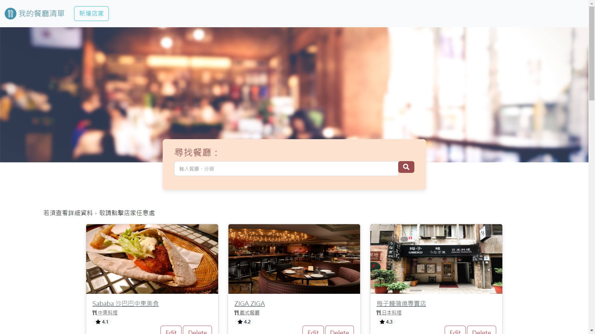

# 打造餐廳清單
本專案以練習路由、handlebars 為主要目的，並提供推薦餐廳的清單。  
點擊餐廳內容框，會跳出店家的進一步介紹，並有附上搜尋功能 (如下連結圖示)。  
  
敬請自由使用。

## 如何才能使用
1. 開啟終端機 (git Bash / Terminal / console)，並 cd 至您想擺放專案的位置
2. 執行

```
git clone https://github.com/chikunmark/S2A7.git
```
3. 安裝必要套件、並初始化  

3.1 進入專案資料夾
```
cd S2A1
```
3.2 安裝必要套件
```
npm install
```
3.3 執行 seeder.js (輸入資料)
```
npm run seed
```
3.4 執行環境
```
npm run dev
```  
4. 開啟瀏覽器 (Chrome, Firefox 等)，並進入以下網址，即可使用本專案
```
http://localhost:8080
```
5. 若遇停止環境 (停用專案)，請在終端機按下 Ctrl + C (windows)，或其 OS 的相應按鍵

謝謝您！

## 使用工具、套件
* Node.js@18.12.0
* npm@8.19.2
* express@4.18.2
* express-handlebars@3.0.0
* mongoose@5.9.13
* body-parser@1.20.1 (內建於 express，直接使用其功能)
* dotenv@16.0.3
